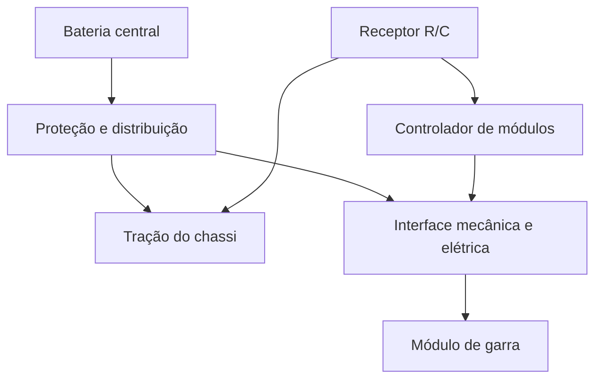

# PRMI — Plataforma Robótica Modular Integrada

Projeto conceitual de uma plataforma móvel elétrica em escala reduzida, com módulos intercambiáveis alimentados pela bateria central. O primeiro MVP proposto é **teleoperado por rádio controle**, com um módulo de garra.

**Status: 🟡 Pesquisa e projeto conceitual — implementação e validação física pendentes.**

## Problema

Em atividades de micro-logística e manutenção, transportar ferramentas e alimentar equipamentos no local de trabalho pode exigir baterias separadas, extensões e soluções dedicadas a cada tarefa.

O PRMI propõe estudar uma base reutilizável que combine transporte, alimentação e controle de módulos funcionais.

## Solução proposta

Adaptar um chassi R/C e criar uma interface comum de fixação, energia e sinais. A bateria da base alimentaria tanto a tração quanto o módulo acoplado, explorando o conceito Vehicle-to-Load (V2L) em uma demonstração acadêmica de baixa tensão.

A garra é o módulo inicial previsto. Bancada móvel de instrumentação e outros módulos são possibilidades posteriores.

## Arquitetura prevista

A troca rápida de módulos é um objetivo. **Hot-swap energizado ainda não foi demonstrado** e depende do projeto de proteção, contatos e sequência de conexão.

## Tecnologias previstas

- Chassi elétrico R/C e receptor com canais auxiliares.
- Arduino Nano ou ESP32, com controle de atuadores por PWM.
- Bateria, proteção e conversores DC/DC.
- Modelagem CAD e impressão 3D.
- Interface padronizada para energia e sinais.

Os modelos definitivos e o dimensionamento elétrico ainda precisam ser definidos.

## Status real

**Já documentado:** problema, conceito de modularidade/V2L, arquitetura inicial, alternativas de componentes e plano de desenvolvimento.

**Ainda pendente:** aquisição e adaptação do chassi, dimensionamento energético, CAD da interface, circuito, firmware, montagem e ensaios.

O Notion registra uma proposta aguardando submissão ao programa de IC da UFMT. Não há confirmação de aprovação ou execução dessa IC. Este repositório não publica código, CAD ou resultados experimentais.

O interesse técnico está na integração entre mecânica, distribuição de energia e controle, especialmente na definição de uma interface reutilizável. Navegação autônoma não faz parte do primeiro MVP.

## Próximos passos

1. Definir o chassi, a carga do módulo e o orçamento de corrente.
2. Projetar fixação, contatos e proteção da interface.
3. Validar alimentação e controle da garra em bancada.
4. Integrar a base e medir tempo de troca, estabilidade elétrica e autonomia.

## Documentação

[Interface modular e decisões em aberto](docs/architecture.md).

João Pedro de Lima Campos — Engenharia de Controle e Automação, UFMT.
